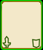

    SDL_Surface *SDL_LoadBMP(const char *file);

## 载入并显示BMP图像 ##

怎么显示一个图像？首先要将它载入内存。载入内存之后呢？
上一节中我们创建了一个`screen`的屏幕表面，你可以把它理解为对应屏幕显示区域的一块显存。
如果我们把载入内存的图像数据复制到`screen`的某个位置，在屏幕显示区域就会看到我们的图像。
确实是这样。继续思考，怎么把图像数据复制到screen所指的数据结构中？
这就引出了今天的主角`SDL_BlitSurface`函数。

    int SDL_BlitSurface(SDL_Surface *src, SDL_Rect *srcrect, SDL_Surface *dst, SDL_Rect *dstrect);

- src是源页面，也就是我们存放图像数据的页面。
- srcrect是源页面上要复制的矩形区域。如果要复制整个源页面，则传递NULL给srcrect即可。
- dst是目标页面，在我们的例子中，它就是屏幕表面`screen`
- dstrect是目标页面上的矩形区域，源页面的上选定的区域将显示在这个矩形区域中。

现在srcrect确定为NULL，dst确定为screen，未定的是src页面和dstrect，dstrect要视src页面的大小而定。

src页面是要装载图像数据的页面。SDL自身支持BMP格式图片的载入，`SDL_LoadBMP`会把bmp图片载入到一个SDL_Surface页面。

我们要使用的bmp图片如下。

`SDL_Surface *temp = SDL_LoadBMP("card.bmp");`把card.bmp的数据装载到temp页面中，现在temp就是源页面，BlitSurface的src参数也确定了。

dstrect是一个指向SDL_Rect结构的地址。SDL_Rect有四个属性：x,y,w,h，分别是左上角的x坐标、y坐标，矩形的宽和高。我们想让图像显示在屏幕区域的左上角，可以把x和y设为0，把w和h设为源页面的宽和高即可。假设源页面是`temp`，我们可以这样定义目标矩形：`SDL_Rect dest_rect = {0, 0, temp->w, temp->h};`，然后将`dest_rect`的地址传递给`dstrect`即可。

再来回顾一下我们要进行的步骤：

1. 载入图像到页面(用SDL_LoadBMP, 搞定)
2. 用BlitSurface函数将页面复制到屏幕表面(四个参数都确定了，搞定)

现在我们可以显示图像了，代码如下：

    SDL_Surface *temp = SDL_LoadBMP("card.bmp");
    SDL_Rect dest_rect = {0, 0, temp->w, temp->h};
    SDL_BlitSurface(card_surface, NULL, screen, &dest_rect);

`make`一下，程序成功生成。运行一下，为什么没有图像？

你记得我们第二节创建页面的时候使用了双缓冲的标志吗？`SDL_DOUBLEBUF`.
双缓冲是在显存中创建了两块区域，一块用于屏幕显示，另一块是离屏页面，用于在后台作图。
当后台图像绘制好后，调用SDL_Flip把离屏页面变为显示页面，原来的显示页面变成离屏页面。（如果我理解有误，请评论告知）。双缓冲可以避免画面闪烁，想想看，为什么？

刚才我们只是把图像画到了离屏页面，难怪屏幕没有显示。赶紧调用SDL_Flip翻转screen吧。
现在程序变成这样：

    SDL_Surface *temp = SDL_LoadBMP("card.bmp");
    SDL_Rect dest_rect = {0, 0, temp->w, temp->h};
    SDL_BlitSurface(card_surface, NULL, screen, &dest_rect);
    /* DO NOT FORGET! */
    SDL_Flip(screen);

程序运行结果如图：

对上面的程序，我们要做一点优化。当bmp图像装载入页面后，其像素格式和屏幕页面的像素格式并不相同，在BlitSurface时需要进行转换。多次BlitSurface就要多次转换，这样很低效。
高效的做法是载入后就转换成和屏幕页面相同的像素格式。可以用SDL_DisplayFormat来完成这一步。

    SDL_Surface *SDL_DisplayFormat(SDL_Surface *surface);

该函数把一个页面的数据转换后复制到新的页面，并返回新的页面。原来的代码片段编程这样。

    SDL_Surface *temp = SDL_LoadBMP("card.bmp");
    SDL_Surface *card_surface = SDL_DisplayFormat(temp);
    /* temp已经没用了，把它释放掉，回收内存 */
    SDL_FreeSurface(temp);
    SDL_Rect dest_rect = {0, 0, card_surface->w, card_surface->h};
    SDL_BlitSurface(card_surface, NULL, screen, &dest_rect);
    /* DO NOT FORGET! */
    SDL_Flip(screen);

完成的程序代码如下：

    /* usage: gcc -o game main.c `sdl-config --cflags --libs` */
    #include <stdio.h>
    #include <SDL.h>
    
    int main(int argc, char *argv[])
    {
        if (SDL_Init(SDL_INIT_VIDEO|SDL_INIT_AUDIO) != 0) {
            printf("Unable to initialize SDL: %s\n", SDL_GetError());
            exit(1);
        }
        atexit(SDL_Quit);
    
        SDL_Surface *screen = SDL_SetVideoMode(320, 480, 0, SDL_HWSURFACE|SDL_DOUBLEBUF);
    
        if (screen == NULL) {
            printf("Unable to set video mode: %s\n", SDL_GetError());
            exit(1);
        }
    
        SDL_WM_SetCaption("Hello, Linux Game!", NULL);
    
        SDL_Surface *temp = SDL_LoadBMP("card.bmp");
        if(temp == NULL) {
            printf("Load bmp image failed!\n");
            exit(1);
        }
    
        SDL_Surface *card_surface = SDL_DisplayFormat(temp);
        SDL_FreeSurface(temp);
    
        SDL_Rect dest_rect = {0, 0, card_surface->w, card_surface->h};
        SDL_BlitSurface(card_surface, NULL, screen, &dest_rect);
        // DO NOT FORGET!
        SDL_Flip(screen);
    
        SDL_FreeSurface(card_surface);

        /* To pause the program */
        while(1){
            SDL_Delay(100);
        }
        return 0;
    }

注意，结尾用了一个死循环防止程序一闪就退出，在命令行你可以用C-c结束程序。
`SDL_Delay(100)`是让程序阻塞100毫秒，这样可以避免空循环把CPU耗尽。

