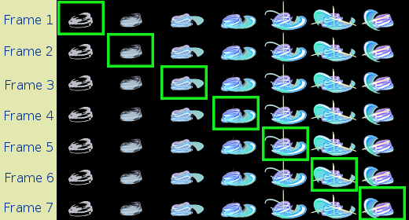

# 第五章 显示动画 #

上一章中我们介绍了如何显示PNG图像，如何过滤掉图像的背景色。这一章我们将讲述如何显示动画。

## 一、计算机动画原理 ##

小时候玩过在书本上制作动画吗？如果我们要做一个人走路的动画，可以把走路分解成七八个连续的动作。然后在书本的边角处顺序画上这连续的动作，一页一个。然后把书本那一角卷窝起来，一放手，被窝起来的书页一页一页快速落下，我们画的那个小人就走起路来。

从这个例子可以看出，动画就是一组连续的画面。

虽然现实世界中的动作是连续的，但做动画的时候我们却可以对现实中的画面进行采样，然后按照固定的时间间隔输出。虽然画面与画面并非真正连续，但我们的大脑会自动对两幅画面之间的变化信息进行补充。

我们日常在电脑上看的电影，也是一幅幅的画面在连续显示。

动画中的每幅画面叫做 *一帧*，只要显示图像的频率（帧率）高于每秒24帧，人脑就感觉动画是流畅的。

## 二、准备素材 ##

知道了动画的原理，我们也知道怎么编程实现动画了。首先有一组连续的图像，然后把这组图像逐帧显示在屏幕的某一区域。每一帧显示的时间为几十毫秒。这样，画面就动起来。

接下来，我们先准备一组连续的图像吧。

技能动画分为7帧，我们每次显示其中的一帧。
BlitSurface函数，
把200x125-skill.png载入页面，
每次Blit其一个矩形区域。

## 编程实现 ##

下面我们编程实现：

    /* 加载技能图像 */
    SDL_Surface *temp = IMG_Load("200x125-skill.png");
    /* 转换图像页面，提高Blit效率 */
    SDL_Surface *card_surface = SDL_DisplayFormat(temp);
    SDL_FreeSurface(temp);
    /* 设置关键色，过滤掉图像背景 */
    SDL_SetColorKey(card_surface, SDL_SRCCOLORKEY|SDL_RLEACCEL, 0);

    /* Blit的源矩形框 */
    SDL_Rect src_rect;
    /* 每一帧的宽和高是固定的 */
    src_rect.w = 200;
    src_rect.h = 125;
    /* 由于各帧排成一行，所以每帧的y是相同的，只有x在变 */
    src_rect.y = 0;
    /* 显示的目标区域是固定在屏幕中间 */
    SDL_Rect dest_rect = {(screen->w - 200)/2, (screen->h - 125)/2, 200, 125};

    int i = 0;

    /* 让技能动画不断循环 */
    while(1){
        /* 清空屏幕 */
        SDL_FillRect(screen, NULL, 0xff009900);
        /* 画技能图像，第i帧的x等于帧宽的i倍 */
        src_rect.x = i * src_rect.w;
        SDL_BlitSurface(card_surface, &src_rect, screen, &dest_rect);
        /* 更新到屏幕 */
        SDL_Flip(screen);
        /* 增加帧数 */
        i ++;
        /* 如果到达最后一帧，回到第0帧*/
        if(i==7) i = 0;
        /* 等待150毫秒，即让每帧的图像停留150ms */
        SDL_Delay(150);
    }

完成代码在这里：
<https://github.com/jollywing/make-linux-rpg/blob/master/chap05>

下载 `main.c` 和 `makefile`，`make` 生成 `game`（MinGW下是`game.exe`）。
运行一下，看看效果。

这之前的程序，我们往往需要在命令行，暴力地结束程序，下一章我们将讲述 `SDL事件`，通过键盘和鼠标优雅地结束程序。
